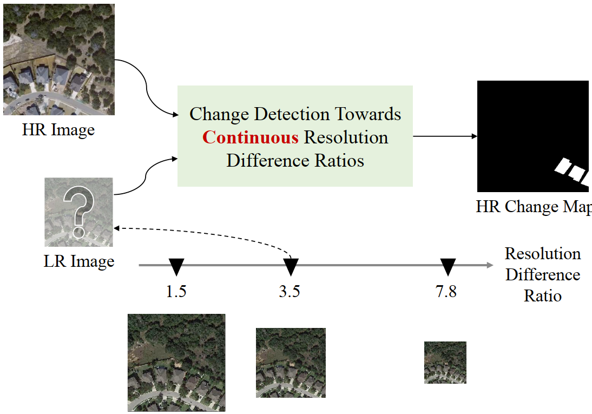
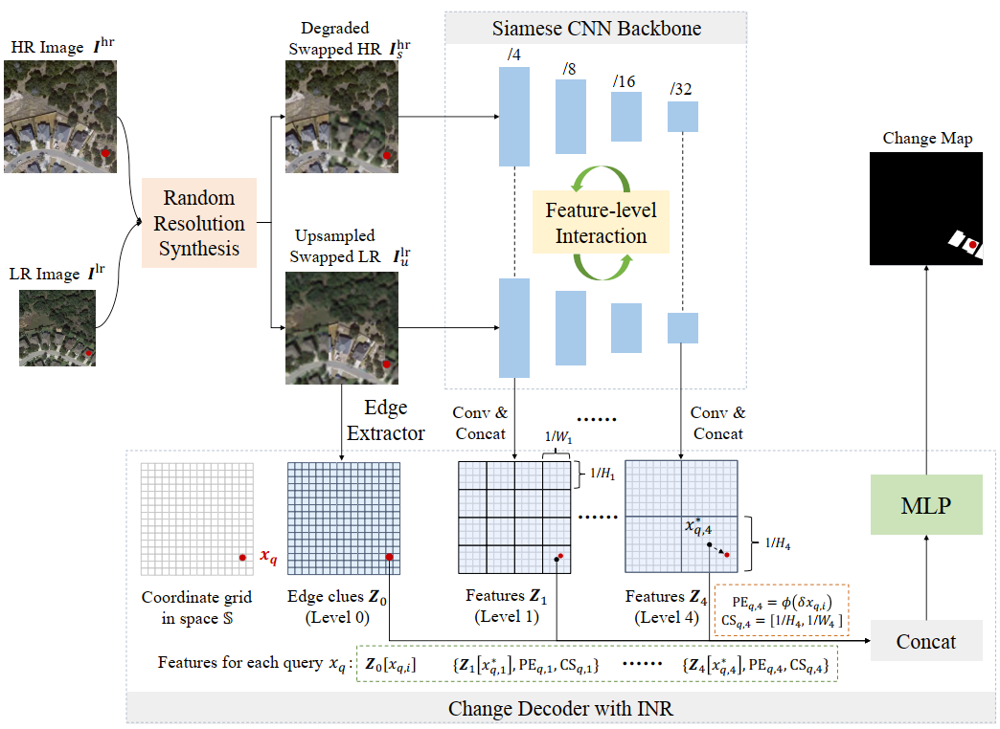

# Continuous Cross-resolution Change Detection

Here, we provide the pytorch implementation of the paper: Continuous Cross-resolution Remote Sensing Image Change Detection.

For more ore information, please see our published paper at IEEE [TGRS](https://ieeexplore.ieee.org/document/10287990) or [arxiv](https://arxiv.org/abs/2305.14722).



The pipeline of our proposed scale-invariant learning with implicit neural networks for remote sensing image change detection is illustrated as follows:



# Requirements

```bash
python 3.7.7
pytorch 1.10.1
torchvision 0.11.2
wanbd 0.12.11
kornia 0.6.3
timm 0.5.4
omegaconf 2.1.1
einops 0.3.0
```

## Logs

20231021: initialize the code.

## Installation

Clone this repository:

```shell
git clone https://github.com/justchenhao/SILI_CD.git
cd SILI_CD
```

## Quick Start

1. Download the checkpoint at https://pan.baidu.com/s/1R2XWu4lDfU1emhXbgrx17A (code: 358c) , and put the folder `ours_levir1x` in the folder `checkpoints`;
2. Execute the script `python try_cd.py` to evaluate our model;
3. The prediction results for samples in  `samples/levir_cut` are saved in the folder `checkpoints/ours_levir1x`. Here, you can see the prediction results of different bitemporal resolution difference ratios.

## Usages

### Dataset configurations

You can configure the name/path/folder_name of the dataset in the file `data_config.py`, as shown below:

```python
if data_name == 'LEVIR':
    self.root_dir = 'Path of the LEVIR-CD root'
    self.img_folder_names = ['A', 'B']
elif data_name == 'SV_CD':
    self.root_dir = 'Path of the SV-CD root'
    self.img_folder_names = ['A', 'B']
elif data_name == 'DE_CD':
    self.root_dir = 'Path of the DE-CD root'
    self.img_folder_names = ['A_low', 'B']
```

### Training

An example of training script can be found in `scripts\cd_train.sh`.

A default configuration for our CD method could be found in `./conf/cd_ours.yaml`. You could also modify certain parameters in the command line.

```bash
#!/usr/bin/env bash

gpus=0
config_path=./conf/cd_ours.yaml
checkpoint_root=checkpoints
pretrained=imagenet
splits=train
model_name=ifa_inter234_local4n_lpe_edgeconv_up2_resnet18_concat
with_wandb=2
scale_mode=3
data_name=LEVIR
scale_ratios=0.25/0.5/0.75/1,0.25
python main_cd.py --scale_mode ${scale_mode}  --data_name ${data_name} --with_wandb $with_wandb --splits ${splits} --scale_ratios ${scale_ratios} --model_name ${model_name} --config_path ${config_path} --gpu_ids ${gpus} --pretrained ${pretrained} --checkpoint_root ${checkpoint_root}

```

### Validation

An example of validation script can be found in `scripts\cd_eval.sh`.

You can testing the model performance on samples with varying bitemporal resolution difference ratios by  setting different scale ratios.

```bash
config_path=./conf/cd_ours.yaml
data_name=LEVIR
model_name=ifa_inter234_local4n_lpe_edgeconv_up2_resnet18_concat
checkpoint_dir='checkpoints/ours_levir1x' # modify it for your checkpoint folder
python main_eval.py --model_name ${model_name} --config_path ${config_path} --data_name ${data_name} --checkpoint_dir ${checkpoint_dir}
```

## Dataset Preparation

### Data structure

```
"""
Change detection data set with pixel-level binary labels；
├─A
├─B
├─label
└─list
"""
```

`A`: images of t1 phase;

`B`:images of t2 phase;

`label`: label maps;

`list`: contains `train.txt`, `val.txt` and `test.txt`, each file records the image names (XXX.png) in the change detection dataset.

### Data Download
LEVIR-CD: https://justchenhao.github.io/LEVIR/

SV-CD: https://drive.google.com/file/d/1GX656JqqOyBi_Ef0w65kDGVto-nHrNs9/edit

DE-CD: 

- Our processed DE-CD data could be downloaded at https://pan.baidu.com/s/1NNoXnwAba41HZppG3flX6A (code: v76s)
- You can also download the original DynamicEarthNet data at https://mediatum.ub.tum.de/1650201

# License
Code is released for non-commercial and research purposes only. For commercial purposes, please contact the authors.

# Citation
If you use this code for your research, please cite our paper:

```latex
@Article{chen2023,
    title={Continuous Cross-resolution Remote Sensing Image Change Detection},
    author={Hao Chen, Haotian Zhang, Keyan Chen, Chenyao Zhou, Song Chen, Zhengxia Zou, Zhenwei Shi},
    year={2023},
    journal={IEEE Transactions on Geoscience and Remote Sensing},
    volume={},
    number={},
    pages={1-21},
    doi={10.1109/TGRS.2023.3325829}
}
```

